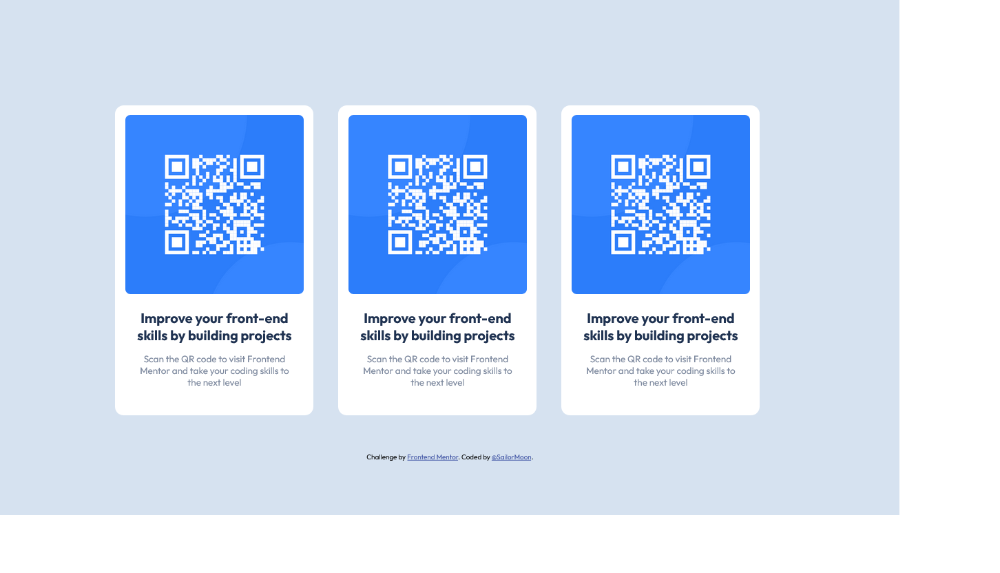

# Frontend Mentor - QR code component solution

This is a solution to the [QR code component challenge on Frontend Mentor](https://www.frontendmentor.io/challenges/qr-code-component-iux_sIO_H). Frontend Mentor challenges help you improve your coding skills by building realistic projects. 

## Table of contents

- [Overview](#overview)
  - [The challenge](#the-challenge)
  - [Screenshot](#screenshot)
  - [Links](#links)
- [My process](#my-process)
  - [Built with](#built-with)
  - [What I learned](#what-i-learned)
- [Author](#author)
- [Acknowledgments](#acknowledgments)

## Overview

### Screenshot

### Links

- Solution URL: [https://github.com/SailorMoonDev/frontendMentorChallenges_QR-code-component_Newbie-HTML-CSS--](https://github.com/SailorMoonDev/frontendMentorChallenges_QR-code-component_Newbie-HTML-CSS--)
- Live Site URL: [https://sailormoondev.github.io/frontendMentorChallenges_QR-code-component_Newbie-HTML-CSS--/](https://sailormoondev.github.io/frontendMentorChallenges_QR-code-component_Newbie-HTML-CSS--/)

## My process

### Built with

- Semantic HTML5 markup
- CSS custom properties
- Flexbox

### What I learned

I am just starting out in the world of web development. I'm taking my first steps with HTML and CSS. Knowing learning resources, the FrontMentor challenges have been a great help.

I added some extra features for practice animations and transitions in CSS

## Author

- Frontend Mentor - [@bonitawendy89](https://www.frontendmentor.io/profile/bonitawendy89)

## Acknowledgments

Thanks to - [@CodingTube](https://www.youtube.com/@CodingTube)
